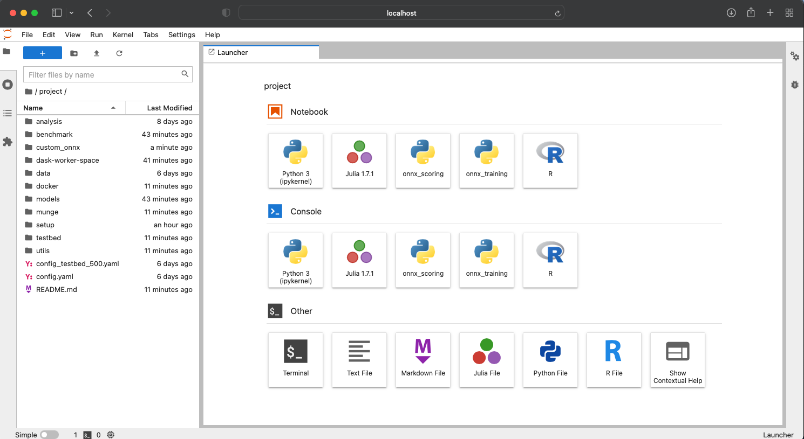

# Docker setup

|File| Description                                                                                 |
|----|---------------------------------------------------------------------------------------------|
|`Dockerfile`| Builds a jupyterlab image with  both `onnx_training` and `onnx_scoring` conda environments. |
|`Dockerfile_onnx_scoring`| Build jupyterlab image with only `onnx_scoring` conda environment.                          |
|`build_image.sh`| Script to builds docker image, run from this directory.                                     |
|`run_notebook.sh`| Starts a local jupyterlab conatiner.  Run from the project's root directory.|

## Local jupyterlab container
